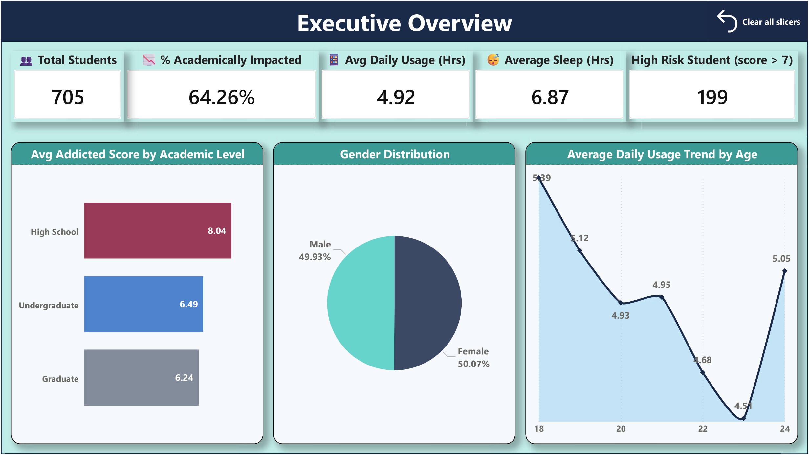
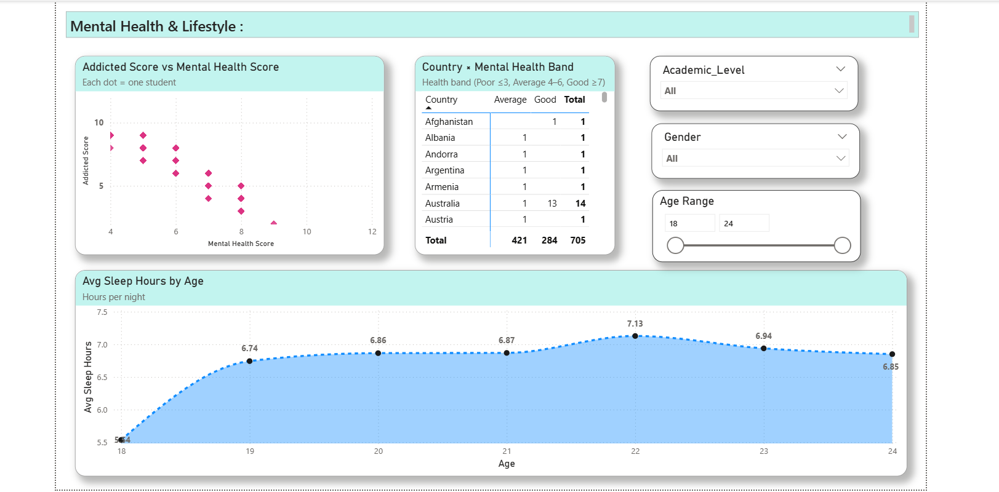
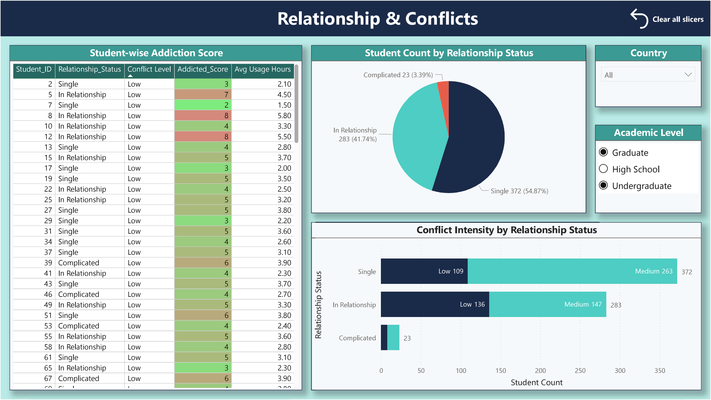
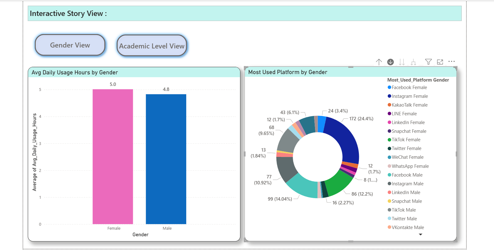
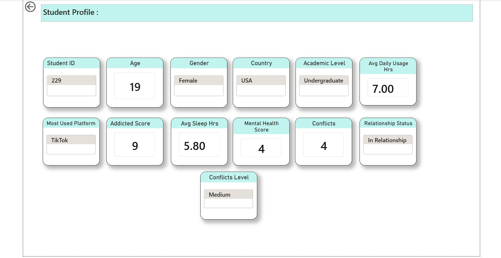

# 📱 Student Social Media Addiction & Behavioral Impact — Power BI Analytics

[](https://powerbi.microsoft.com/)
[](https://github.com/mailmetanmaymandal92)
[](https://github.com/mailmetanmaymandal92)
[](LICENSE)

An end-to-end interactive Power BI business intelligence dashboard analyzing the empirical relationships between daily social media usage, academic performance impacts, sleep patterns, mental health scores, and relationship conflict intensity across global student demographics.

---

## 📋 Business Problem & Objective
Academic administrators, educators, and student wellness counselors require empirical visibility into how digital media consumption impacts student well-being. This project establishes an interactive analytics platform to quantify:
- The prevalence and severity of social media addiction across academic tiers (High School, Undergraduate, Graduate).
- The percentage of students experiencing negative academic performance consequences.
- The behavioral trade-offs between daily usage hours, sleep duration, and mental wellness indicators.
- Social platform preference distributions across demographics and relationship conflict correlation.

---

## 📊 Dataset & Model Architecture
- **Source**: Comprehensive Student Social Media Addiction Survey (`data/Students Social Media Addiction.xlsx`).
- **Scope**: 705 student records spanning global geographies and ages 18–24.
- **Relational Schema**: Two interrelated tables joined on `Student_ID`:
  - **`Student Details`**: `Student_ID`, `Age`, `Gender`, `Academic_Level`, `Country`, `Sleep_Hours_Per_Night`, `Mental_Health_Score`, `Relationship_Status`, `Conflicts_Over_Social_Media`, `Addicted_Score`.
  - **`Platform Details`**: `Student_ID`, `Avg_Daily_Usage_Hours`, `Most_Used_Platform`, `Affects_Academic_Performance`.

---

## 📈 Dashboard Highlights

### 1. Executive Overview & Mental Health
| Executive Overview | Mental Health & Lifestyle |
|:---:|:---:|
| [](./screenshots/executive_overview.png) | [](./screenshots/mental_health_&_lifestyle.png) |
| *KPI Cards (705 Students, 64.26% Impacted, 4.92h Usage, 6.87h Sleep, 199 High-Risk), Addiction Score by Academic Level, Gender split, and Usage Trend by Age.* | *Country vs Health Band distribution, Sleep Duration by Age (18–24), and Addiction Score vs Mental Health Score matrix.* |

### 2. Academic Impact & Relationship Dynamics
| Academic Impact & Performance | Relationship & Conflicts |
|:---:|:---:|
| [](./screenshots/academic_impact.png) | [](./screenshots/relationship_conflicts.png) |
| *Daily Usage by Academic Level (High School: 5.5h, Undergrad: 5.0h, Grad: 4.8h) and platform-wise academic disruption across Instagram, TikTok, Facebook, etc.* | *Student-wise addiction scores, Relationship Status distribution (54.87% Single, 41.74% In Relationship), and Conflict Intensity analysis.* |

### 3. Demographic Stories & Individual Profiles
| Interactive Story View | Drill-Through Student Profile |
|:---:|:---:|
| [](./screenshots/interactive_story_view.png) | [](./screenshots/drill_through_student_profile.png) |
| *Bookmark-driven demographic perspectives: Avg usage by gender (Female: 5.0h, Male: 4.8h) and Most Used Platform donut breakdown.* | *Granular student profile card matrix: Mental Health Score, Sleep Hours, Screen Time, Addiction Score, Preferred Platform, Conflict Level, Country, and Age.* |

---

## 🔬 Methodology & DAX Engineering
1. **Star Schema Data Modeling**: Normalized survey responses into structured fact and dimension tables with active one-to-one/many relationships on `Student_ID`.
2. **Key DAX Measures & Formulations**:
   - **Academically Impacted Ratio**:
     ```dax
     % Academically Impacted = 
     DIVIDE(
         CALCULATE(COUNTROWS('Platform Details'), 'Platform Details'[Affects_Academic_Performance] = "Yes"),
         COUNTROWS('Platform Details'),
         0
     )
     ```
   - **High-Risk Addiction Cohort**:
     ```dax
     High Risk Students = 
     CALCULATE(
         COUNTROWS('Student Details'),
         'Student Details'[Addicted_Score] > 7
     )
     ```
   - **Average Daily Usage & Sleep Metrics**:
     ```dax
     Avg Daily Usage = AVERAGE('Platform Details'[Avg_Daily_Usage_Hours])
     Avg Sleep Hours = AVERAGE('Student Details'[Sleep_Hours_Per_Night])
     ```
3. **Interactive Slicers & Navigation**:
   - Universal slicers for Country, Gender, Age Range (18–24 slider), and Academic Level.
   - Bookmark-driven view toggling (Gender View vs. Academic Level View).
   - Drill-through page navigation for granular individual student auditing.

---

## 🔍 Key Insights & Findings
- **Academic Hierarchy Risk**: High School students experience the highest average addiction score (**8.04 / 10**) and longest daily usage (**5.5 hrs**), compared to Undergraduates (**6.49 / 5.0 hrs**) and Graduates (**6.24 / 4.8 hrs**).
- **Widespread Academic Impact**: **64.26%** of all surveyed students report negative effects on their academic performance directly attributed to social media habits.
- **Platform Concentration**: **Instagram (35.32%)** and **TikTok (21.84%)** dominate total screen time, accounting for over **57%** of preferred usage and driving the largest shares of academic disruption.
- **Critical Risk Segment**: **199 out of 705 students (28.2%)** fall into the high-risk addiction band (`Addicted_Score > 7`), exhibiting strong negative correlations with sleep duration and mental wellness ratings.

---

## 💻 Tech Stack & Deliverables
- **BI Platform**: Microsoft Power BI Desktop
- **Modeling / Calculations**: DAX (Data Analysis Expressions), Power Query ETL
- **Repository Deliverables**:
  - `dashboards/social_media_dashboard.pbix` — Full interactive Power BI workbook.
  - `dashboards/social_media_dashboard.pdf` — High-resolution executive dashboard export.
  - `data/Students Social Media Addiction.xlsx` — Source survey dataset.
  - `screenshots/` — High-definition 16:9 dashboard captures for all 6 analytics views.

---

## 🚀 How to Run / Reproduce
1. Clone the repository:
   ```bash
   git clone https://github.com/mailmetanmaymandal92/PowerBI-Student-Social-Media-Impact.git
   ```
2. Open `dashboards/social_media_dashboard.pbix` in [Microsoft Power BI Desktop](https://powerbi.microsoft.com/desktop/) (free).
3. Review the complete multi-page report or explore the pre-exported [PDF report](dashboards/social_media_dashboard.pdf).

---

## 👤 Author & Contact

**Tanmay Mandal** &bull; Data Analyst | Business Intelligence & Analytics Specialist  
- 🌐 **GitHub**: [mailmetanmaymandal92](https://github.com/mailmetanmaymandal92)  
- 💼 **LinkedIn**: [Tanmay Mandal](https://www.linkedin.com/in/tanmay-mandal-83976131a/)  
- 📧 **Email**: [mailme.tanmaymandal@gmail.com](mailto:mailme.tanmaymandal@gmail.com)
